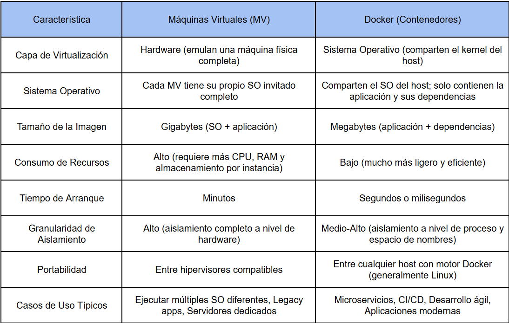

[Similitudes entre Máquinas Virtuales y Docker](Similitudes.md)

## Diferencias Clave y Perspectivas de la Comunidad

Las diferencias entre Máquinas Virtuales y Docker son las que definen sus casos de uso óptimos. Estas diferencias radican principalmente en la capa de virtualización, el consumo de recursos, el tiempo de arranque y la granularidad del aislamiento.

Las comunidades en foros como Reddit y GitHub a menudo discuten cuándo usar una tecnología u otra, y las opiniones resaltan estas diferencias prácticas:

- **Rendimiento y Ligereza:** Una de las diferencias más citadas es el rendimiento y la ligereza de los contenedores. Un usuario en un hilo de Reddit sobre "VMs vs. Docker" comentó: "Para microservicios o aplicaciones que necesitan escalar rápidamente, Docker es el rey. Puedes lanzar cientos de contenedores en la misma máquina donde solo podrías tener unas pocas VMs. El overhead es mínimo." (Reddit, r/sysadmin, 2023). Otro usuario en GitHub, discutiendo la implementación de un CI/CD, señaló: "El tiempo de spin-up de los contenedores es un game-changer para CI/CD. No podemos esperar minutos para que una VM se inicie para cada test." (GitHub Issues, CI/CD discussion, 2024).

- **Aislamiento y Seguridad:** Cuando la seguridad y el aislamiento absoluto son primordiales, las MV suelen ser preferidas. Un hilo de Reddit en r/devops debatió este punto: "Si tienes aplicaciones multi-tenant o si la seguridad a nivel de kernel es una preocupación crítica, las VMs aún tienen una ventaja. El aislamiento completo del kernel de una VM ofrece una barrera de seguridad más robusta que los contenedores que comparten el kernel del host." (Reddit, r/devops, 2023). Sin embargo, también se reconoce que las capacidades de aislamiento de los contenedores han mejorado significativamente con el tiempo.

- **Entornos Heterogéneos y Legado:** Para ejecutar sistemas operativos completamente diferentes (por ejemplo, Windows en un host Linux o viceversa) o aplicaciones legacy que tienen dependencias muy específicas del SO, las máquinas virtuales son la única opción viable. "Tenemos algunos sistemas antiguos que necesitan Windows Server 2008 R2, y simplemente no puedes 'dockerizar' eso en un host Linux. VMs son la solución ahí," compartió un administrador en un foro de TI. (Foro de administradores de sistemas, 2022).

- **Simplicidad para Desarrolladores:** Docker ha ganado terreno en la comunidad de desarrollo por su simplicidad en el empaquetado y la distribución de aplicaciones. Un desarrollador en Stack Overflow (similar a GitHub en cuanto a discusiones técnicas) mencionó: "Docker simplificó mi flujo de trabajo como nunca antes. Empaqueto mi app, se la paso a operaciones, y sé que va a funcionar. Las VMs eran un dolor de cabeza para esto." (Stack Overflow, 2021).

[Conclusión](Conclusión.md)